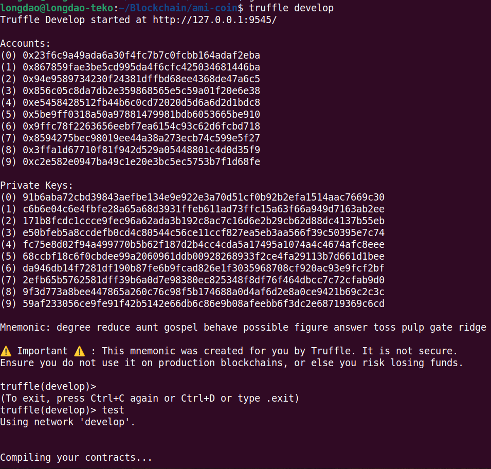
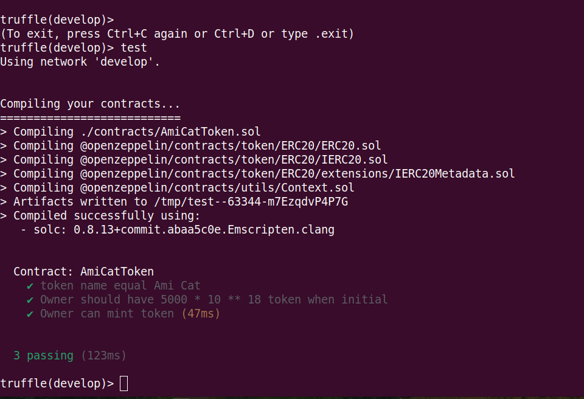

# Unit test Smart Contract
 
# Initial
Project build một SC theo chuẩn ERC20 có tính năng
* Khởi tạo SC với name = Ami Cat,  symbol = AMI, người khởi tạo SC sẽ được mint sẵn 5000 * 10 ** 18 token
* Giới hạn max token của SC là 10000000 * 10 ** 18


# Unit test
Viết Unitest để kiểm tra 3 case
* token name equal Ami Cat
* Owner should have 5000 * 10 ** 18 token when initial
* Owner can mint token

# Install
Cài đặt Truffle
```
$ npm install -g truffle
```

Compile và deploy contract trên RemixIDE như bình thường

Test contract
```
$ truffle develop       // start một process Truffle Develop
> compile       // compile smart contract
> test
```



